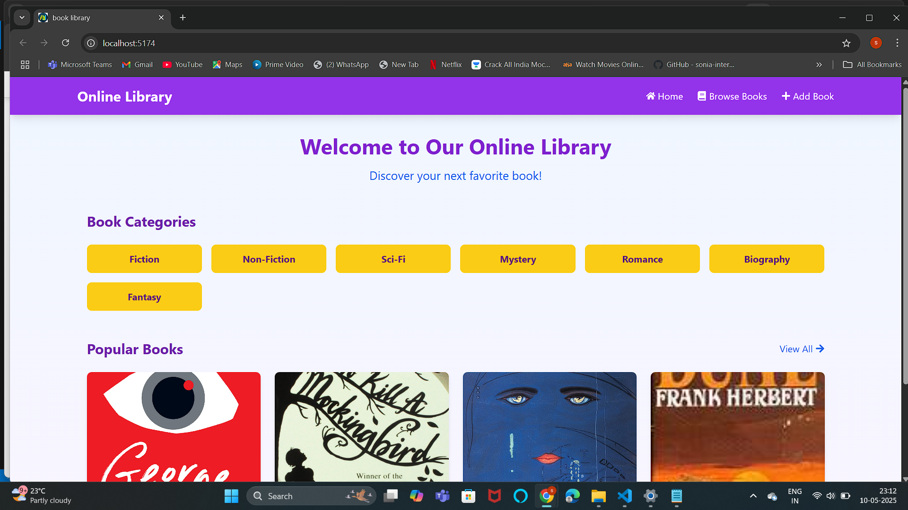

# Online Library System

A React-based online library management system with book browsing, details viewing, and book addition functionality.

 

## Features

- Browse books by category
- View detailed book information
- Add new books to the library
- Search functionality
- Responsive design with bright color scheme

## Technologies Used

- React.js
- Redux Toolkit (for state management)
- React Router (for navigation)
- Tailwind CSS (for styling)
- React Icons
- Vite (build tool)

## Installation and Setup

### Prerequisites
- Node.js (v14 or later)
- npm (v6 or later) or yarn

### Running the Application

1. **Clone the repository**
   ```bash
   git clone https://github.com/SUKANYA108/online-book-library.git
   cd online-library-system